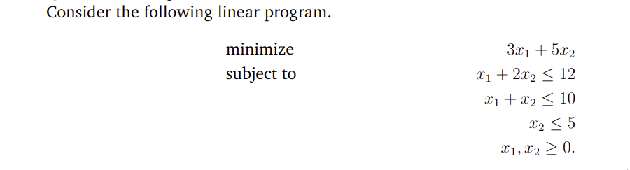
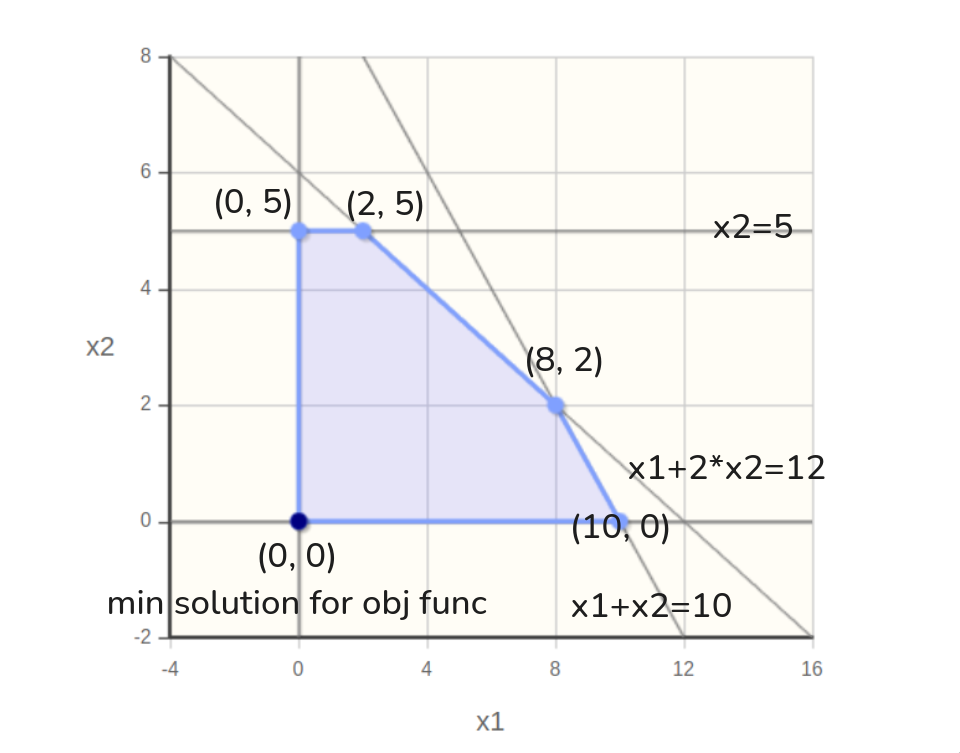
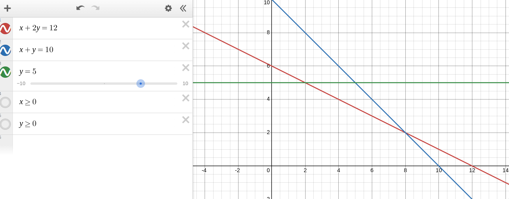
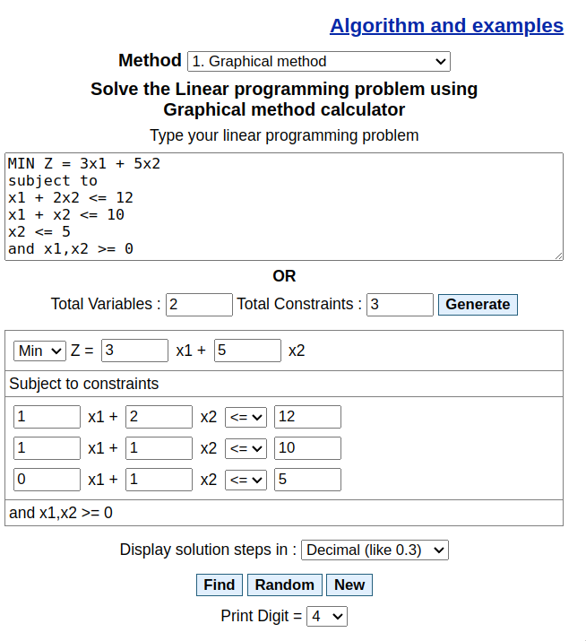
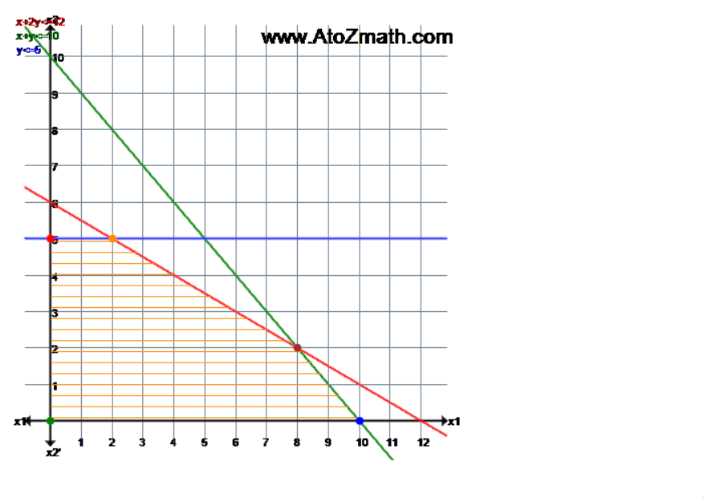
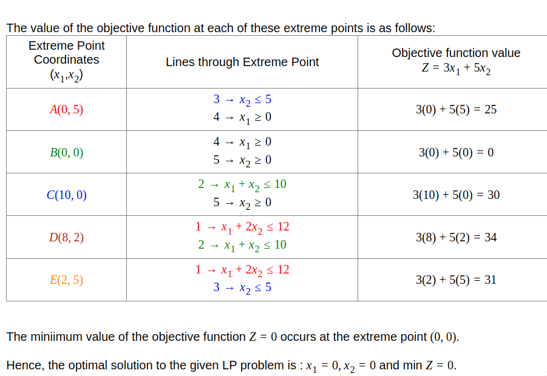
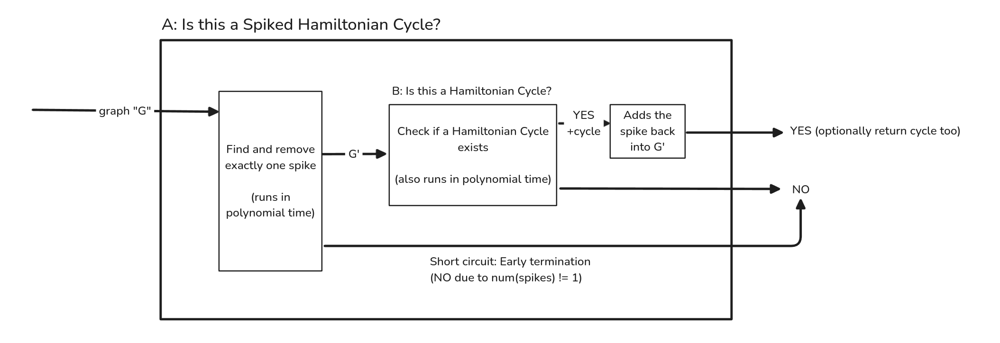

# COMP 3804: Assignment 4

## Submission Details

{{ read_csv('details.csv') }}

## Question 1

You and m − 1 of your friends live all in different cities (m > 1). Each of you has a car and can start driving right now (after determining the meeting location). You drive on a road network, i.e, you have cities as vertices and two cities are connected via a directed edge if there is a road between them; the weight of the directed edge (u; v) is the time it takes you to get from u to v. The number of vertices is n and you may assume that the number of edges is also O(n). You want to meet as soon as possible. How would you select a meeting location from one of your k favourite hang-out spot known to all of you? Which algorithm would you use and how is this done most efficiently. The more efficient the solution, the better the mark. State the complexities in terms of m; k, and n, you can make case distincations between m and k. Sometimes an algorithm can be stopped while it is still running to make it a bit faster. Descibe precisely here when and how you could terminate your algorithm.

### Answer

Let $M = \{m_1, m_2, \ldots, m_{m}\}$ be the set of cities, where $m_i$ is the city of the $i$-th person.
Let $K = \{k_1, k_2, \ldots, k_{k}\}$  be the set of cities, where $k_i$ is the city of the $i$-th hangout spot.

We will also modify the Dijkstra's algorithm to terminate early when all nodes of interest during an exploration has been reached (it is uncessary to continue traversing the graph at this point).

```plaintext
function DijkstraTerminateEarly(Graph, source, Graph.NodesOfInterest):
    for each vertex v in Graph.Vertices:
        dist[v] ← INFINITY
        prev[v] ← UNDEFINED
        add v to Q
   
    for each node n in Graph.NodesOfInterest:
        visited[n] ← False
    
    dist[source] ← 0
    visited[source] ← True

    while Q is not empty:
        u ← vertex in Q with minimum dist[u]
        remove u from Q
        visited[u] ← True

        /*
            TERMINATE EARLY
            To further optimize this check, we can use a bitwise OR operation to check that visited[n] for all n in Graph.NodesOfInterest is True.
        */
        if all visited[n] for n in Graph.NodesOfInterest is True:
            break
       
        for each neighbor v of u still in Q:
            alt ← dist[u] + Graph.Edges(u, v)
            if alt < dist[v]:
                dist[v] ← alt
                prev[v] ← u

    return dist[], prev[]
```

Case 1: $|K| \geq |M|$

In this case, there are more hangout spots than there are friends. To optimize, we would compute the shortest path only as many times as there are **friends**.

```plaintext
for each city 'm' in M:
    dist[], prev[] ← DijkstraTerminateEarly(Graph, m, K)
    m.dist[] ← dist[]

highest_min_dist ← INFINITY // We want to find a k that minimizes this. For example, [1, 5] is less preferable than [3, 3], because the meeting has to wait for the slowest person to arrive before starting.
meeting_spot ← UNDEFINED

for each city 'k' in K:
    highest_min_dist_k ← -INFINITY
    
    // Find the highest min_dist among all friends to travel to k
    for each city 'm' in M:
        if m.dist[k] > highest_min_dist_k:
            highest_min_dist_k ← m.dist[k]
    
    // If this k has a lower highest_min_dist than then current meeting spot, update the meeting spot
    if highest_min_dist_k < highest_min_dist:
        highest_min_dist ← highest_min_dist_k
        meeting_spot ← k
```

Case 2: $|K| < |M|$

In this case, there are more friends than there are hangout spots. To optimize, we would compute the shortest path only as many times as there are **hangout spots**.

```plaintext
E ← Graph.Edges

// Flip the direction of each edge
for each edge (u, v) in E:
    E ← (v, u)

for each city 'k' in K:
    dist[], prev[] ← DijkstraTerminateEarly(Graph, k, M)
    for city 'm' in dist:
        if m in M:
            m.dist[k] ← dist[m]

// This point onwards is the same as the previous case
highest_min_dist ← INFINITY
meeting_spot ← UNDEFINED

for each city 'k' in K:
    highest_min_dist_k ← -INFINITY
    for each city 'm' in M:
        if m.dist[k] > highest_min_dist_k:
            highest_min_dist_k ← m.dist[k]
    if highest_min_dist_k < highest_min_dist:
        highest_min_dist ← highest_min_dist_k
        meeting_spot ← k
```

Remember that in the previous assignment, we have proved that the shortest distance from point A to point B is the same as the shortest distance from point B to point A. Therefore, we can **flip the direction of the edges** to optimize the algorithm, while still preserving the correctness of the algorithm.

The reason we are doing this is because this time, we are ^^starting Dijkstra's algorithm from the hangout spots^^ (instead of from each $m$), and we want to find the shortest path from the hangout spots to the friends. Without flipping the edges, the algorithm would be incorrect: Just because we can reach $m_i$ from $k_j$ does not mean we can reach $k_j$ from $m_i$.


In either case, we make use of ==Fibonacci Heaps== to optimize Dijkstra's algo.

**Complexity Analysis:**

First, we recognize that Case B is guaranteed to be slower than Case A in the worst case, every single time we run it. This is because Case B does ostensibly the same things as Case A, but with added complexity to accomodate for edge reversals. This way, we can analyze the Big-Oh of Case B, and call it the Big-Oh of the entire algorithm.

Now let's dive in.

```plaintext
// Flip the direction of each edge
for each edge (u, v) in E:
    E ← (v, u)
```

This is O(|E|). Because the question states that the number of edges is O(n), this is O(n).

```plaintext
for each city 'k' in K:
    dist[], prev[] ← DijkstraTerminateEarly(Graph, k, M)
    for city 'm' in dist:
        if m in M:
            m.dist[k] ← dist[m]
```

This is O(|K| * x), where x is the complexity of DijkstraTerminateEarly. Because DijkstraTerminateEarly is a lightly modified version of Dijkstra's algorithm that only adds a constant number of operations to each iteration, it has the same complexity as plain old Dijkstra's. Using Fibonacci Heaps, that is 0(|V| log |V| + |E|).

Remember that we had stated that O(|E|) = O(n). The number of vertices is O(n), so the complexity of DijkstraTerminateEarly is O(n log n + n) = O(n log n).

Because we run this for each city in K, the total complexity of this block is O(|K| * n log n).

```plaintext
// This point onwards is the same as the previous case
highest_min_dist ← INFINITY
meeting_spot ← UNDEFINED
```

Obviously, O(1).

```plaintext
for each city 'k' in K:
    highest_min_dist_k ← -INFINITY
    for each city 'm' in M:
        if m.dist[k] > highest_min_dist_k:
            highest_min_dist_k ← m.dist[k]
    if highest_min_dist_k < highest_min_dist:
        highest_min_dist ← highest_min_dist_k
        meeting_spot ← k
```

This is O(|K| * |M|), which is O(m * k) because of the nested loops.

Adding it all up, the total complexity of the algorithm is O(m*k + nlogn).

## Question 2

Find an optimal parameterization of a matrix-chain product whose sequence of dimensions is (3, 10, 2, 120, 5, 100, 4). Show the two solution matrices. How many different ways are there to evaluate this(!) matrix-chain product (i.e., different bracketings)?

### Answer {#q2-ans}

The dimensions of the source matrices are given as follows:

1. $A_1$: $3 \times 10$
2. $A_2$: $10 \times 2$
3. $A_3$: $2 \times 120$
4. $A_4$: $120 \times 5$
5. $A_5$: $5 \times 100$
6. $A_6$: $100 \times 4$

The number of different ways to evaluate a matrix-chain product is given by the **Catalan number**, with $n$ being the number of matrices, and $C_{n-1}$ being the number of possible parenthesizations. We will take this for granted because this has been ^^proven in lectures^^. The Catalan number is given by the formula:

$$
C_n = \frac{1}{n+1} \binom{2n}{n}
$$

where $n$ is the number of matrices in the chain. In this case, $n = 6$, so the number of ways to evaluate the matrix-chain product is:

$$
C_5 = \frac{1}{6} \binom{10}{5} = 42
$$


Next, we will compute the $m$ and $s$, tables for the matrix-chain product. $m$ represents the minimum number of scalar multiplications needed to compute the matrix product, and $s$ represents the index at which the split should be made to achieve the minimum number of scalar multiplications *(as seen in the pseudocode above)*.

For this, I have computed **by-hand** the $m$ and $s$ tables by following the algorithm in the textbook. As well, I have created some visualization tools using a Javascript graphics library ([$m$ table generator](https://editor.p5js.org/voidranjer/sketches/GMzhsXoEE), and [$s$ table generator](https://editor.p5js.org/voidranjer/sketches/uEHpbUJhz)) that can be used to verify and generate these table diagrams, as shown below. The source code that I wrote for these tools can be provided upon request.


Then, by following the $s$ table, we can generate the optimal parenthesization of the matrix-chain product. The optimal parenthesization is as follows:

$$
\begin{align*}
(A_1 A_2 A_3 A_4 A_5 A_6) \\
(A_1 A_2) (A_3 A_4 A_5 A_6) \\
(A_1 A_2) ((A_3 A_4 A_5) A_6) \\
(A_1 A_2) (((A_3 A_4) A_5) A_6)
\end{align*}
$$

**Therefore, the optimal parenthesization of the matrix-chain product is $(A_1 A_2)(((A_3 A_4) A_5)A_6)$. This is done at the minimum cost of 3084 scalar multiplications, which is the best of all 42 possible parenthesizations.**

## Question 3



### Answer {#q3-ans}

- Show the feasible region by plotting the constraints on the ($x_1$, $x_2$)-Cartesian coordinate system.




---

- Using your feasible region, find the optimal solution for this linear program. Is this the only solution? If yes, then explain why. If no, then state how many optimal solutions are there and justify your answer.

**Vertices:** *in the format ($x_1$, $x_2$)*

- (0, 5)
- (2, 5)
- (8, 2)
- (10, 0)
- (0, 0)

**Objective Function:** $3x_1+5x_2$ (minimize)

**Try each vertex:**

- (0, 5): $3(0) + 5(5) = 25$
- (2, 5): $3(2) + 5(5) = 31$
- (8, 2): $3(8) + 5(2) = 34$
- (10, 0): $3(10) + 5(0) = 30$
- (0, 0): $3(0) + 5(0) = 0$

**Optimal Solution:** (0, 0) with a value of 0.

---

- Enter the LP into an LP solver that you can get from the internet and show us the input and solution pages (via screen captures).





## Question 4

Suppose we have a polynomial-time reduction from Problem A to Problem B. Suppose further we know that Problem B has a polynomial-time solution.

- What can we conclude about Problem A, if anything?

If Problem A can be reduced to Problem B, we know that Problem B is more powerful than Problem A.

**Meaning, Problem B is at least as hard as Problem A.** If Problem B has a polynomial-time solution, then Problem A must also have a polynomial-time solution.

Thus, solving Problem A requires only:

- **Polynomial time to reduce Problem A to Problem B**, and
- **Polynomial time to solve Problem B**.

**Therefore, the conclusion is thatt Problem A can also be solved in polynomial time**, implying that Problem A is in **P**.

---

- Suppose the polynomial-time reduction is now from Problem B to Problem A. What can we conclude about Problem A, if anything?

This doesn't tell us much about Problem A at all, really. We are saying that **Problem A is at least as hard as Problem B** (and possibly even harder than Problem B).

This is why just because Problem B can be solved in polynomial time, it doesn't necessarily mean that Problem A can be solved in polynomial time.

It might be the case that Problem A is much harder than Problem B, and thus, it might not be in **P**.

**In conclusion: From the polynomial-time reduction from Problem B to Problem A, we cannot directly conclude anything about the time complexity of Problem A. It might still be in P, NP, or harder (e.g., NP-hard, etc).**

## Question 5

We are considering the following problem: Does a given directed graph G have a spiked Hamiltonian cycle?. A spiked Hamiltonian cycle is a Hamiltonian cycle of all vertices of graph G except for one which must be joint to the cycle via a single edge (say directed from the vertex to the cycle). (So it sticks out) Reduce this problem to the problem of finding Hamiltonian cycles in directed graphs. The reduction needs to be polynomial; note you can call Hamiltonian Cycle problem a polynomial number of times. Carefully argue the correctness of your reduction. You are allowed to assume for this question that in any graph you consider the Hamiltonian cycle (if it exists) is unique (obviosuly, that is not true in general.)

### Answer {#q5-ans}

For this question, we assume that the implementation of the graph G allows us access to the set of all vertices (and the correspending edges to each one), which we can iterate through in linear time.

```plaintext linenums="1" hl_lines="1-14"
num_potential_spikes ← 0
spike_vertex ← UNDEFINED

for each vertex v in G:
    if degree(v) == 1:
        num_potential_spikes ← num_potential_spikes + 1
        spike_vertex ← v
        if num_potential_spikes > 1:
            break, and TERMINATE EARLY (returning "NO SPIKED HAMILTONIAN CYCLES") // cannot have more than 1 spike

if num_potential_spikes == 0:
    return "NO SPIKED HAMILTONIAN CYCLES" // no spikes

G' ← G with spike_vertex removed

if HamiltonianCycle(G') exists: // this runs in polynomial time
    return "YES" // spiked Hamiltonian cycle exists
else:
    return "NO" // no spiked Hamiltonian cycle
```

Lines 1-14 of the pseudocode above describe the reduction from the spiked Hamiltonian cycle problem to the Hamiltonian cycle problem. The reduction works as follows:

1. We iterate through all vertices of the graph G.
2. For each vertex, we check if the degree of the vertex is 1. If it is, we increment the count of potential spikes and store the vertex as the spike vertex.
3. If we find more than one potential spike, we terminate early and return "NO SPIKED HAMILTONIAN CYCLES" because a spiked Hamiltonian cycle cannot have more than one spike.
4. If we find no potential spikes, we return "NO SPIKED HAMILTONIAN CYCLES" because a spiked Hamiltonian cycle must have a spike.
5. We create a new graph G' by removing the spike vertex from G.
6. We check if G' has a Hamiltonian cycle using the Hamiltonian cycle algorithm.
7. If G' has a Hamiltonian cycle, we return "YES" because G has a spiked Hamiltonian cycle.
8. If G' does not have a Hamiltonian cycle, we return "NO" because G does not have a spiked Hamiltonian cycle.

We have to prove that there is a bijection between the set of spiked Hamiltonian cycles in G and the set of Hamiltonian cycles in G'. This is because the reduction is correct if and only if there is a one-to-one correspondence between the solutions of the original problem and the solutions of the reduced problem.


In order for a node to be part of a valid Hamiltonian cycle, **exactly two** of its edges has to be part of the set of edges that make up the complete Hamiltonian cycle. Note that we are ^^not^^ saying that it cannot have more than two edges; but only two of them can be part of the Hamiltonian cycle.

We will also note that neither of these two Hamiltonian-involved edges can be the spike edge. This is because the spike edge connects the current vertex to an island vertex, and this is a dead end *(meaning it cannot be part of the Hamiltonian cycle)*.

That means that the edge connecting the spike vertex to the Hamiltonian cycle can never be part of the Hamiltonian cycle. Because of this, **the removal of this "spike edge" will not affect the Hamiltonian cycle in any way**. Hence, we can transform the problem of finding a spiked Hamiltonian cycle into the problem of finding a Hamiltonian cycle by removing the spike vertex and its connecting edge, and we can guarantee that the solution to the reduced problem is a solution to the original problem.

The illustration for this reduction:



<iframe src="https://editor.p5js.org/voidranjer/full/GMzhsXoEE" width="600" height="600"></iframe>

## Useful Resources

- <https://stackoverflow.com/questions/26547816/understanding-time-complexity-calculation-for-dijkstra-algorithm>
- <https://stackoverflow.com/questions/50458834/dijkstra-time-complexity-using-binary-heap>
- <https://math.stackexchange.com/questions/3683910/time-complexity-of-dijkstras-algorithm>
