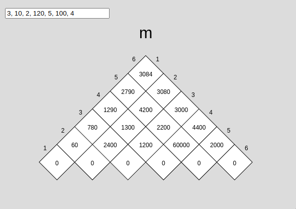
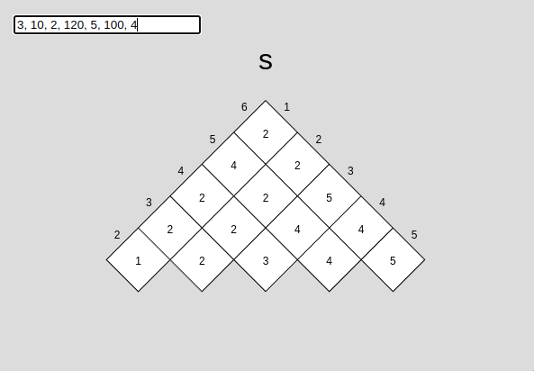
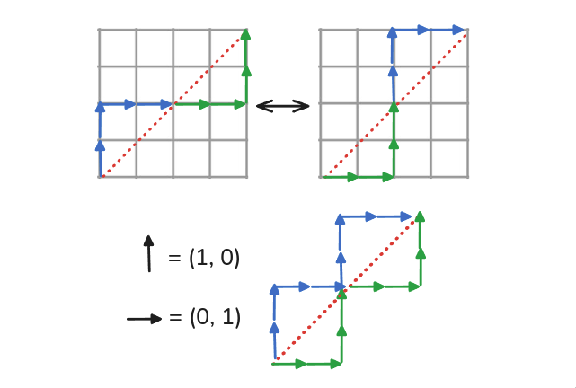
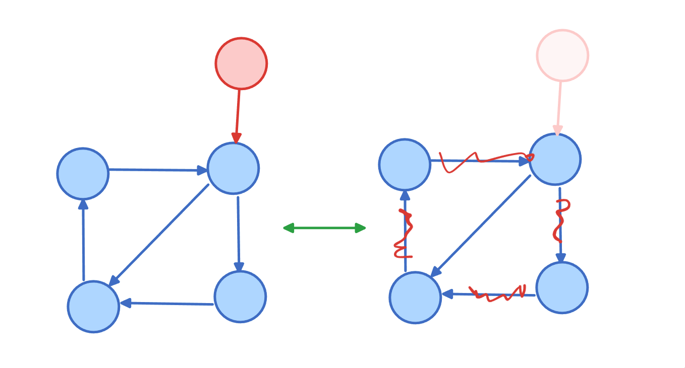
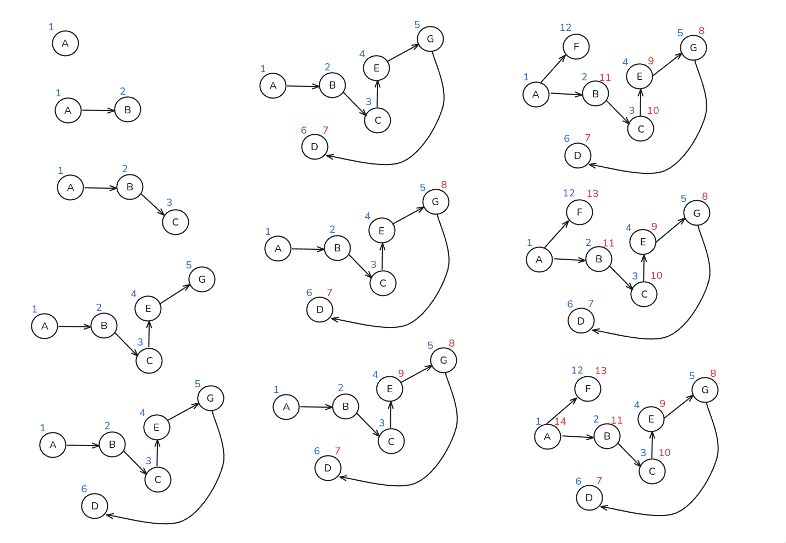
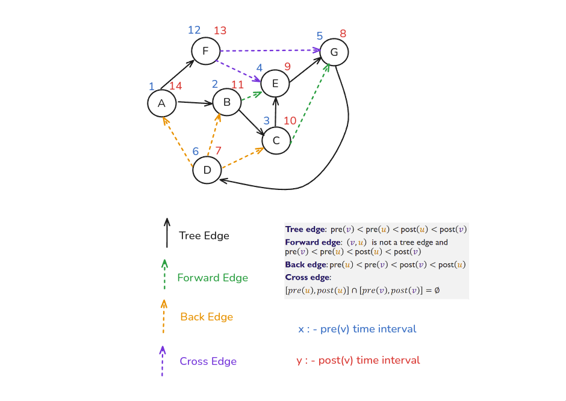
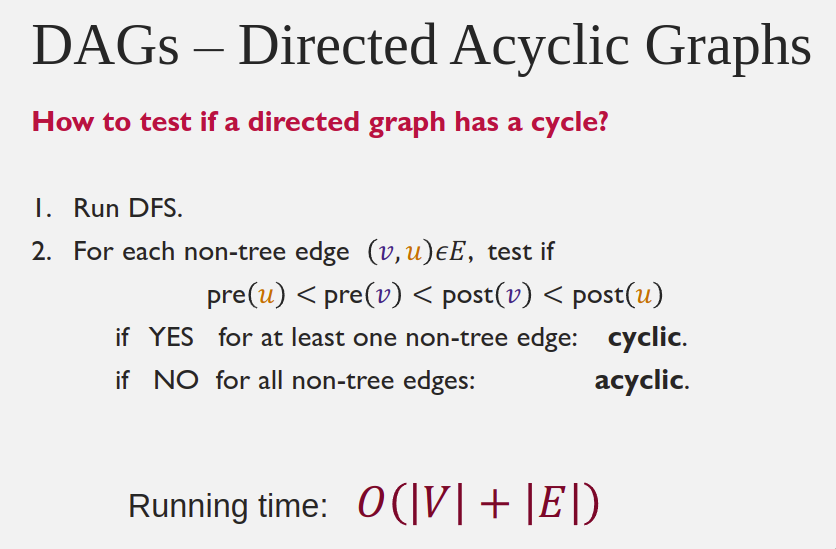

# COMP 3804: Assignment 3

## Submission Details

{{ read_csv('details.csv') }}

## Question 1

We are given a directed graph $G =(V,E)$ with $|V|$  = $n$ vertices.  Let $goal$ be a vertex  of $G$.  We want to compute a shortest path   from each of  $k$ vertices of $G$ to $goal$, where $k<n$.

- We could solve the problem by applying Dijkstra's algorithm $k$ times, ones for each of the $k$ starting vertices. What is the time  complexity (stated in terms of $n$ and $k$)? 

---

**^^==Answer==^^:** Dijkstra's time complexity is $O((|E|+|V|) \times \log |V|)$ using **standard heaps**, where $E$ is the set of all edges in the graph, and $V$ is the set of all vertices. Since we are running Dijkstra's algorithm $k$ times, the time complexity of the solution is $O(k \times (|E|+|V|) \times \log |V|)$.

---

- Alternately, we could  start at  the vertex $goal$ and  somehow go backwards to all $k$ vertices. Describe how this would work, i.e., how would we modify Dijkstra's algorithm and/or its input to achieve this?  Then, state the time complexity of this solution to our original problem. (Do not forget to argue why the algorithm, as modified, is correct!)

---

**^^==Answer:==^^** The output of Dijkstra's algorithm is the shortest path from a source vertex to **all other vertices** in a graph. The keyword here is **"all"**. If we do this, then we are effectively computing the ^^shortest path from **each** vertex $k$ to **every other vertex** in the graph.^^

However, we only care about the shortest path between each vertex $k$ to the $goal$ vertex. This is wasteful as we are doing a ton of unecessary computations *(we do not need to know the shortest path to every other node, just the $goal$ node)*.

**The solution:** Instead, we can modify Dijkstra's algorithm to start at the $goal$ vertex and work backwards to all $k$ vertices. We can do this by **reversing the direction** of the edges in the graph. This way, we can compute the shortest path from the $goal$ vertex to all $k$ vertices. We'll just have to remember to reverse the path at the end to get the original path directions.

This way, instead of computing $k$ number of shortest path graphs, we are only computing **exactly 1** shortest path graph. The time complexity of this solution is $O((|E|+|V|) \times \log |V|)$, which is the same as Dijkstra's algorithm.

**Correctness:** The correctness of this algorithm is guaranteed by the fact that the shortest path from a source vertex to a destination vertex is the same as the shortest path from the destination vertex to the source vertex when the direction of the edges is reversed.

---

## Question 2

Let $G =(V,E)$  be a graph with vertex set,  $V$, and edge set $E$.  We would like to apply Topological Sort on $G$. One problem is that we do not know if $G$ is a DAG or not. What will happen if we apply the algorithm for  Topological Sorting on $G$ if $G$ is not a DAG?

---

**^^==Answer:==^^** We state that we expect the Topological Sort algorithm will fail. The theory is that a graph that isn't a DAG (a graph with a cycle, for example) will produce an infinite loop because there are subgraphs that are cyclic, producing no vertices with in-degree of 0 during the execution of the algorithm. We will now provide a concrete example.

Consider such a graph as the one in the diagram above. Note that a cycle exists between ${A, B, C}$.

According to the Topological Sorting algorithm, we are to start each iteration from a vertex with in-degree of 0. In this case, we can start from vertex $A$ because it has in-degree 0. We will then remove the edge between $A$ and $B$. Then, we update all the in-degrees to their new values.

**Issue arises:** See that we have decremented the in-degree of $B$ from 2 to 1. However, this is insufficient because none of the vertices have in-degree of 0. We are now unable to continue with topological sort.

---

## Question 3

Suppose we consider lattice paths from $(0,0)$ to $(n,n)$ on an  $n$  by  $n$ grid. The paths must, at every step,  either go up or  right. We call lattice path, $k$-Lpaths, if  they have precisely $2k$ path segments on one side of the diagonal  and the remaining $2(n-k)$ segments on the other.  Argue precisely why the number of $k$-Lpaths is equal to the number of $(n-k)$-Lpaths. 

---

**^^==Answer==^^:**

First, notice the bijection between the graph on the left and the graph on the right.

Given that these are Cartesian grids with the top right corner being $(n,n)$ and the bottom left corner being $(0,0)$:

For every graph that adheres to the $k$-Lpaths, we can reflect it along the diagonal to get a graph that adheres to the $(n-k)$-Lpaths. This is because the reflection of a path that goes up will go right, and vice versa. This is a bijection because the reflection is reversible. We can define such a matrix to be the reflection matrix.

\[
\mathbf{A} = 
\begin{bmatrix}
0 & 1 \\
1 & 0
\end{bmatrix}
\]

Then, for every vector that represents each path item, we can multiply it by the reflection matrix to get the reflected path. 

1. **Transforming \((0, 1)\) to \((1, 0)\)**:

\[
\begin{bmatrix}
0 & 1 \\
1 & 0
\end{bmatrix}
\cdot
\begin{bmatrix}
0 \\
1
\end{bmatrix}
=
\begin{bmatrix}
(0 \times 0) + (1 \times 1) \\
(1 \times 0) + (0 \times 1)
\end{bmatrix}
=
\begin{bmatrix}
1 \\
0
\end{bmatrix}
\]

2. **Transforming \((1, 0)\) to \((0, 1)\)**:

\[
\begin{bmatrix}
0 & 1 \\
1 & 0
\end{bmatrix}
\cdot
\begin{bmatrix}
1 \\
0
\end{bmatrix}
=
\begin{bmatrix}
(0 \times 1) + (1 \times 0) \\
(1 \times 1) + (0 \times 0)
\end{bmatrix}
=
\begin{bmatrix}
0 \\
1
\end{bmatrix}
\]

**In conclusion:** For any arrangement of $k$-Lpaths, we can reflect it along the diagonal to get an $(n-k)$-Lpaths arrangement. This is a bijection because the reflection is reversible. Therefore, the number of $k$-Lpaths is equal to the number of $(n-k)$-Lpaths.

---

## Question 4

- Run DFS, from A, on the graph and classify each edge as being either: Tree edge, Forward edge, Back edge, or Cross edge. Show and argue: the algorithm execution,   pre(v) and post(v) time intervals and the edge-classification. (An edge type may or may not appear in a particular graph.)

---

**^^==Answer==^^:**

The diagram below breaks down the execution of DFS with the time intervals annotated in **blue** and **red**.

**Blue** represents the pre-visit time, while **red** represents the post-visit time.

The different types of edges *(tree, forward, back, cross)* are also described in the legend section of the image below.

**Arguments:** I will not provide an exhaustive list of arguments for each edge. However, I will provide an example:

Observe that with edge $A \rightarrow F$, pre($v$) $= 1$, post($v$) $= 14$, pre($u$) $= 12$, post($u$) $= 13$, such that $\text{pre}(v) < \text{pre}(u) < \text{post}(u) < \text{post}(v)$.

---

- Find a topological order of the nodes or argue that no such order can exist. How does the DFS help detect that?

---

**^^==Answer==^^:**

There is this algorithm that we can run alongside DFS to determine if a graph has cycles or not:

If we detect a cycle, then we can conclude that no topological order exists. This is because a topological order is only possible in a Directed Acyclic Graph (DAG). If a cycle exists, then the graph is not a DAG, and therefore, no topological order exists.

---

- Consider two intervals $[pre(u), post(u)]$ and $[pre(v), post(v)]$ for vertices $u$ and $v$, respectively. Argue precisely in your own words, why the intervals cannot overlap (other than if one is contained in the other).

---

**^^==Answer==^^:**

The intervals $[pre(u), post(u)]$ and $[pre(v), post(v)]$ for vertices $u$ and $v$, respectively, cannot overlap because of the following reasons:

1. **Vertex $u$ is a descendant of vertex $v$:** If vertex $u$ is a descendant of vertex $v$, then the pre-visit time of $u$ will be greater than the pre-visit time of $v$. This is because the pre-visit time of a descendant is always greater than the pre-visit time of its ancestor. Therefore, the interval $[pre(u), post(u)]$ will be contained within the interval $[pre(v), post(v)]$.

2. **Vertex $u$ is an ancestor of vertex $v$:** If vertex $u$ is an ancestor of vertex $v$, then the post-visit time of $u$ will be less than the post-visit time of $v$. This is because the post-visit time of an ancestor is always less than the post-visit time of its descendant. Therefore, the interval $[pre(u), post(u)]$ will be contained within the interval $[pre(v), post(v)]$.

3. **Vertex $u$ and $v$ are unrelated:** If vertex $u$ and $v$ are unrelated, then the intervals $[pre(u), post(u)]$ and $[pre(v), post(v)]$ will not overlap. This is because the pre-visit and post-visit times of unrelated vertices are independent of each other.

**Proof by exhaustion:** The only two ways to have no overlap is for $\text{post}(u) < \text{pre}(v)$ or $\text{post}(v) < \text{pre}(u)$ *(assuming pre-visit always has to be less than post-visit for the same node)*. For example: $[pre(u), post(u)]$ and $[pre(v), post(v)]$ is $[1, 2]$ and $[3, 4]$.

Assume we are entering vertex $u$. This sets the pre-visit time of $u$ to be 1. Then, we proceed to vertex $v$, which is a descendant of $u$. This sets the pre-visit time of $v$ to be 2. Note that it is **impossible** to set the post-visit time of $u$ **before** setting the post-visit time of $v$ if $v$ is a descendant of $u$. This is because by definition, the post-visit time of a vertex is only set once all descendants of that vertex have been visited.

Since we **must** set the post-visit time of $v$ (which is the descendant) before setting the post-visit time of $u$ (which is the ancestor), combined with the fact that the clock interval **must** increase at each turn, we see that $post(v) < post(u)$.

Therefore, the intervals $[pre(u), post(u)]$ and $[pre(v), post(v)]$ for vertices $u$ and $v$, respectively, cannot overlap unless one is contained within the other.

---